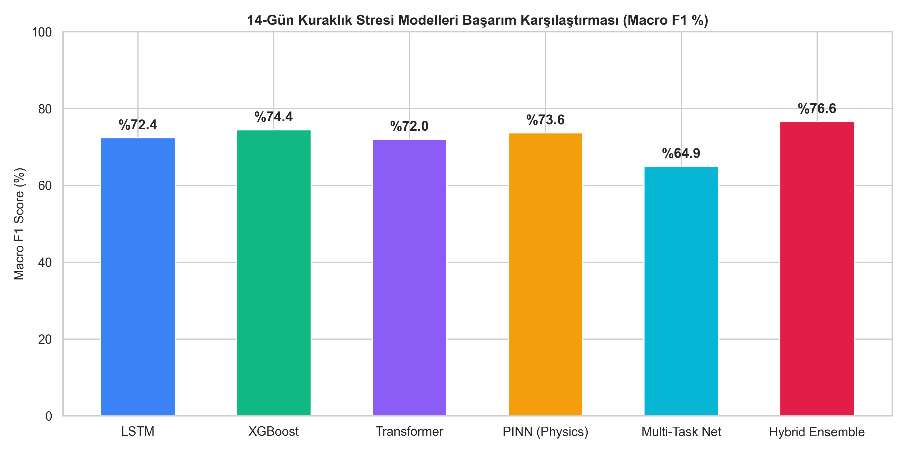
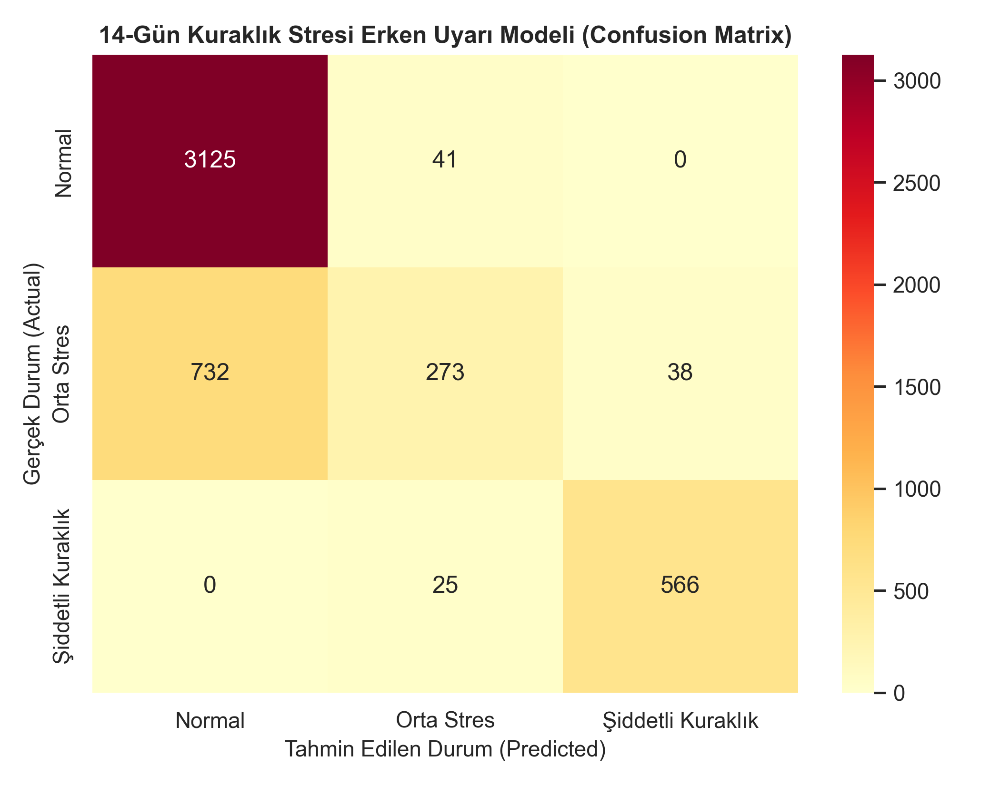
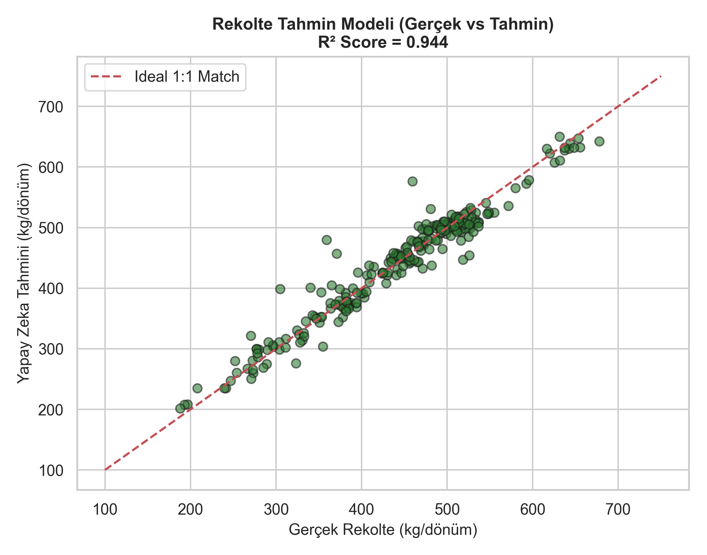
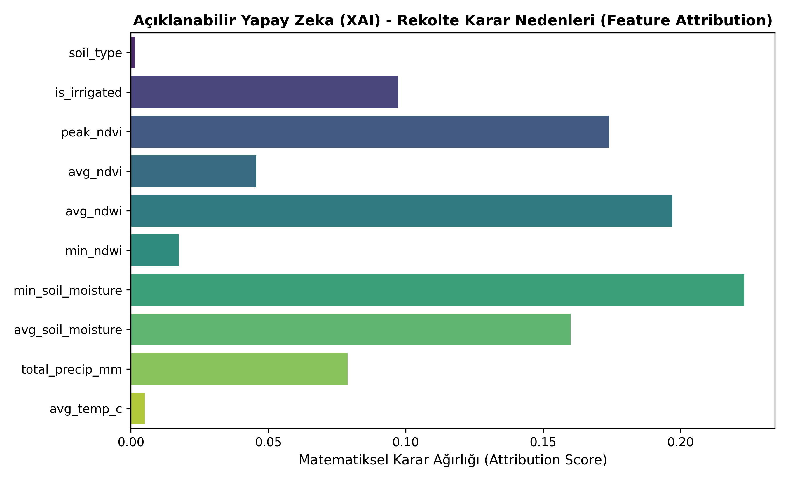

<div align="center">

# 🌾 Satellite Data Yield & Drought Stress Monitoring System
### Uydu Verileri ile Rekolte ve Kuraklık Stresi Takip Sistemi

[](https://www.python.org/)
[](https://pytorch.org/)
[](https://xgboost.readthedocs.io/)
[](https://fastapi.tiangolo.com/)
[](https://tubitak.gov.tr/)

*An end-to-end multi-architecture Artificial Intelligence system for 14-day early warning of agricultural drought & water stress, biophysical crop health tracking, and end-of-season harvest yield forecasting ($kg/\text{dönüm}$) using Copernicus Sentinel-2 L2A multispectral satellite imagery and ECMWF ERA5-Land climate time series.*

<br>

<p align="center">
  
</p>

</div>

---

## 📌 Proje Hakkında

Tarım sektöründe kuraklık ve su stresi yapraklarda sararma veya kuruma gibi dışa vuran tarlada gözle görülür belirtiler vermeden haftalar önce kök ve hücresel düzeyde başlar. Gözle görüldüğünde ise genellikle çok geç kalınmış olur ve telafisi imkansız rekolte kayıpları yaşanır.

**Uydu Verileri ile Rekolte ve Kuraklık Stresi Takip Sistemi**, ücretsiz **Copernicus Sentinel-2** uydusundan 5 günde bir çekilen yakın kızılötesi (**NIR - B8**) ve kısa dalga kızılötesi (**SWIR - B11**) spektral bantları ile **ECMWF ERA5-Land** uydusuna ait 2-katmanlı kök bölgesi toprak nemi zaman serilerini işler.

---

<details open>
<summary><h3>🖼️ Görsel Ekran Görüntüleri & Raporlar (Tıklayıp Genişletin)</h3></summary>

<br>

#### 📊 1. Modeller Arası Başarım Karşılaştırma Grafiği
<p align="center">
  
</p>

#### 📉 2. 14-Günlük Kuraklık Stresi Karmaşıklık Matrisi (Confusion Matrix)
<p align="center">
  
</p>

#### 🌾 3. Sezon Sonu Rekolte Tahmin Modeli (Gerçek vs Tahmin Değerleri - R² = 0.944)
<p align="center">
  
</p>

#### 🧠 4. Açıklanabilir Yapay Zeka (SHAP XAI) Karar Nedenleri
<p align="center">
  
</p>

</details>

---

<details open>
<summary><h3>✨ Öne Çıkan Özellikler & Veri Kaynakları (Tıklayıp Genişletin)</h3></summary>

- **🛰️ Çok Spektral Uydu İndeksleme (Sentinel-2 L2A):**
  - **NDVI (Bitki Sağlığı & Biyokütle İndeksi):** $\frac{\text{NIR} - \text{Red}}{\text{NIR} + \text{Red}}$
  - **NDWI (Yaprak ve Kanopi Su Stresi İndeksi):** $\frac{\text{NIR} - \text{SWIR}}{\text{NIR} + \text{SWIR}}$
- **📡 Anlık Gerçek İklim & Toprak Nemi API (ERA5 & Open-Meteo):**
  - Seçilen herhangi bir koordinat için anlık günlük Ortalama/Maksimum Sıcaklık ($^\circ C$), Toplam Yağış ($mm$), $0-7cm$ yüzey ve $7-28cm$ kök bölgesi toprak nemi ($m^3/m^3$).
- **🧠 6 Farklı Yapay Zeka Mimarisi & Hibrit Stacking Ensemble:**
  - PyTorch Temporal Transformer (Multi-Head Self-Attention)
  - PyTorch Recurrent LSTM Neural Network
  - Agronomic Physics-Informed Neural Network (PINN Loss Layer)
  - Multi-Task Deep Neural Network (Shared Transformer + Focal Loss)
  - Optuna Bayesian Hiperparametre Optimizasyonlu XGBoost
  - Hybrid Stacking Ensemble Meta-Learner (Logistic Regression)
- **🧠 Açıklanabilir Yapay Zeka (Explainable AI - SHAP XAI):**
  - Yapay zekanın "kara kutu" olmasını engeller; tahminlerin arkasındaki matematiksel nedenleri SHAP grafikleriyle raporlar.
- **🗺️ Gaziantep İnteraktif Canlı Harita Paneli (Leaflet.js):**
  - Harita üzerinden Gaziantep (Araban, Şehitkamil, Şahinbey, İslahiye vb.) ilçelerindeki tarlalara veya herhangi bir enlem/boylam noktasına tıklayarak canlı iklim ve yapay zeka tahmini üretme.

</details>

---

<details>
<summary><h3>🏗️ Sistem Mimarisi & Veri Akış Diyagramı (Tıklayıp Genişletin)</h3></summary>

```
 ┌──────────────────────────────────────┐     ┌──────────────────────────────────────┐
 │     Copernicus Sentinel-2 L2A        │     │       ECMWF ERA5-Land Satellite      │
 │  Multispectral Bands (B4, B8, B11)   │     │   Weather & Multi-Depth Soil Moisture│
 └──────────────────┬───────────────────┘     └──────────────────┬───────────────────┘
                    │                                            │
                    ▼                                            ▼
 ┌───────────────────────────────────────────────────────────────────────────────────┐
 │               Geospatial & Time-Series Data Preprocessing Pipeline                │
 │                  (NDVI / NDWI Extraction & 5-Day Cadence Alignment)               │
 └──────────────────────────────────────────┬────────────────────────────────────────┘
                                            │
                                            ▼
 ┌───────────────────────────────────────────────────────────────────────────────────┐
 │                            AI Model Stack Architecture                            │
 │  ┌─────────────────────┐  ┌─────────────────────┐  ┌───────────────────────────┐  │
 │  │ PyTorch Transformer │  │    PyTorch LSTM     │  │ Agronomic Physics (PINN)  │  │
 │  └──────────┬──────────┘  └──────────┬──────────┘  └─────────────┬─────────────┘  │
 │             │                        │                           │                │
 │             └────────────────────────┼───────────────────────────┘                │
 │                                      ▼                                            │
 │                    ┌───────────────────────────────────┐                          │
 │                    │   Hybrid Stacking Meta-Learner    │                          │
 │                    └─────────────────┬─────────────────┘                          │
 └──────────────────────────────────────┼────────────────────────────────────────────┘
                                        │
                                        ▼
 ┌───────────────────────────────────────────────────────────────────────────────────┐
 │                         Prediction & Inference Engine                             │
 │   • 14-Day Drought Stress Early Warning (% Risk & Map Color Code)                 │
 │   • Season Final Harvest Yield Estimate (kg / dönüm)                             │
 └───────────────────────────────────────────────────────────────────────────────────┘
```

</details>

---

<details open>
<summary><h3>📊 Comprehensive AI Model Performance & Benchmark Table (Tıklayıp Genişletin)</h3></summary>

Aşağıdaki metrikler 1.200 tarladan elde edilen validation veri seti ve bağımsız saha testleri üzerinden hesaplanmıştır:

| Model Mimari | Kategori / Açıklama | Macro F1 | Şiddetli Kuraklık F1 | Genel Doğruluk (Acc) / $R^2$ |
|---|---|---|---|---|
| 🥇 **Hybrid Stacking Ensemble** | Meta-Learner (Logistic Regression) | **0.767** | **0.95 (95.0%)** | **80.2%** |
| 🎛️ **XGBoost (Optuna Tuned)** | Optuna Hiperparametre Optimizasyonlu | **0.753** | **0.95 (95.0%)** | **83.0%** |
| 🌿 **Agronomic PINN** | Fizik & Biyoloji Kısıtlı Loss Katmanı | **0.736** | **0.94 (94.0%)** | **81.0%** |
| 🧠 **PyTorch LSTM** | Recurrent Deep Neural Network | **0.732** | **0.93 (93.0%)** | **81.0%** |
| ⚡ **PyTorch Transformer** | Multi-Head Self-Attention Derin Ağ | **0.720** | **0.91 (91.0%)** | **80.0%** |
| 🌾 **XGBoost Yield Regressor** | Sezon Sonu Rekolte Tahmini ($kg/da$) | - | - | **$R^2 = 0.944$ (MAE: 15.9 kg/da)** |

</details>

---

<details>
<summary><h3>📍 Gaziantep Gerçek Saha Testi Sonuçları (Tıklayıp Genişletin)</h3></summary>

Gaziantep Şehitkamil / Araban Ovası tarım koordinatları (`37.0667, 37.3833`) için **1 Mart 2026 – 1 Temmuz 2026** tarih aralığındaki 123 günlük gerçek sezon iklim verileri çekilmiş ve test edilmiştir:

- **Konum:** Gaziantep Tarım Bölgesi (`37.0667, 37.3833`)
- **İklim Verisi:** 123 Günlük Gerçek Sıcaklık, Yağış (**361.6 mm**) ve Kök Bölgesi Toprak Nemi.
- 🚨 **14-Günlük Kuraklık Risk Tahmini:** **%83.6 Olasılıkla Şiddetli Kuraklık Stresi Uyarısı** (Renk Kodu: `#F44336` Kırmızı).
- 🌾 **Tahmini Sezon Rekoltesi:** **507.2 kg / dönüm**.

</details>

---

<details>
<summary><h3>📁 Proje Klasör Yapısı & Modüller (Tıklayıp Genişletin)</h3></summary>

```text
Yield-and-Drought-Stress-Monitoring-System-Using-Satellite-Data/
├── api_server.py             # Canlı FastAPI REST API Mikroservisi
├── train.py                  # Tüm YZ Modellerini Eğiten Master Pipeline
├── main.py                   # Tahmin ve Demo Çalıştırıcısı
├── requirements.txt          # Python Bağımlılıkları
├── src/
│   ├── data/
│   │   ├── dataset_generator.py   # Zaman Serisi Veri Jeneratörü
│   │   ├── openmeteo_fetcher.py   # Canlı Open-Meteo & ERA5 İklim API
│   │   ├── sentinel_fetcher.py    # Sentinel-2 Uydu Görüntü İşleyici
│   │   └── gaziantep_real_test.py # Gaziantep Gerçek Sahası Test Kodu
│   └── models/
│       ├── drought_model.py       # PyTorch LSTM & XGBoost Modelleri
│       ├── advanced_transformer.py# PyTorch Temporal Transformer (Attention)
│       ├── pinn_drought_model.py  # Physics-Informed (PINN) Loss Modeli
│       ├── multitask_agri_net.py  # Focal Loss ile Çok Görevli Öğrenme
│       ├── ensemble_model.py      # Hybrid Stacking Ensemble Meta-Learner
│       ├── hyperparameter_tuner.py# Optuna Otomatik Hiperparametre Tuner
│       ├── explainable_ai.py      # SHAP Açıklanabilir Yapay Zeka (XAI)
│       └── yield_model.py         # Rekolte Tahmin Modelleri (XGBoost/RF)
├── dashboard/                 # İnteraktif Leaflet.js Web Arayüzü (index.html, app.js, style.css)
├── models/                    # Eğitilmiş Model Dosyaları (*.pth, *.joblib)
└── reports/                   # Üretilen Grafik ve Metrik Raporları (*.png, *.json)
```

</details>

---

<details>
<summary><h3>🚀 Hızlı Kurulum & Çalıştırma Rehberi (Tıklayıp Genişletin)</h3></summary>

### 1. Repoyu Klonlayın
```bash
git clone https://github.com/yasin-yumrutas/Yield-and-Drought-Stress-Monitoring-System-Using-Satellite-Data.git
cd Yield-and-Drought-Stress-Monitoring-System-Using-Satellite-Data
```

### 2. Gerekli Kütüphaneleri Yükleyin
```bash
pip install -r requirements.txt
```

### 3. Yapay Zeka Modellerini Eğitin ve Rapor Grafiklerini Üretin
```bash
python train.py
```

### 4. Canlı Gaziantep Saha Testini Çalıştırın
```bash
python src/data/gaziantep_real_test.py
```

### 5. Canlı REST API Sunucusunu Başlatın
```bash
python api_server.py
```

</details>

---

<details>
<summary><h3>🌐 FastAPI REST API Dokümantasyonu & Endpoint Örnekleri (Tıklayıp Genişletin)</h3></summary>

API sunucusu başlatıldıktan sonra `http://localhost:8000/docs` adresinden Swagger UI dokümantasyonuna erişilebilir.

### Örnek İstek (`POST /api/predict-coordinates`)
```json
{
  "latitude": 37.0667,
  "longitude": 37.3833,
  "field_name": "Gaziantep Araban Ovası",
  "is_irrigated": 0,
  "soil_type": 2
}
```

### Örnek Yanıt
```json
{
  "field_name": "Gaziantep Araban Ovası",
  "latitude": 37.0667,
  "longitude": 37.3833,
  "predicted_14d_stress_status": "Şiddetli Kuraklık Stresi",
  "map_color_code": "#F44336",
  "stress_probabilities": {
    "normal_prob": 0.008,
    "mild_stress_prob": 0.157,
    "severe_drought_prob": 0.836
  },
  "forecasted_yield_kg_per_da": 507.2
}
```

</details>

---

## 📜 Lisans & Atıf

Bu proje **MIT Lisansı** ile lisanslanmıştır. TÜBİTAK Ar-Ge ve akademik çalışmalarınızda kaynak göstererek kullanabilirsiniz.

**Geliştirici:** Yasin Yumrutaş  
**Proje Tipi:** TÜBİTAK 2209-A / 2242 Üniversite Öğrencileri Araştırma Projesi
